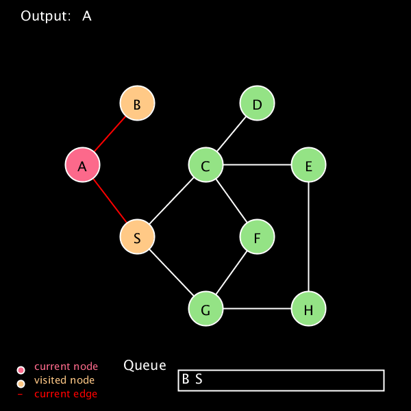

# Breadth first search (BFS)

## General idea

This is a simple visualization of BFS algorithm. The sketch starts with predefined graph. The program then visits each nodes using BFS algorithm. A set of colors is used to help better understand how the program goes:

+ Yellow is for unvisited node

+ Pink is used to indicate current node

+ Green is for visited nodes

## Structure

I used different classes for each object in the sketch. There are 3 main: **Node**, **Edge**, and **Graph** classes that construct the predefined graph. Methods such as: `visit()` and `traverse()` are for changing the attributes of those classes. Other methods such as `queueDisplay()` and `legend()` are for the display of the sketch.
