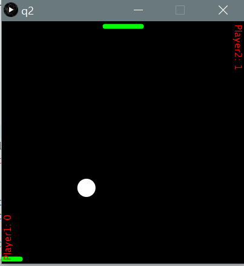

# Air Hockey game
A common arcade game made with processing

## How I made it
Similar to [ball-target game](../ballTarget), the ball moves freely until it collides with any edge, except for the upper and lower ones, then changes its direction.
Two paddles are needed for two players with differnt ways of controlling (I use mouse for first player and arrow keys for the second one). 
Using if-else statements to detect if the ball is in the lower bound or upper bound. If so, check if the ball touches any paddle.  