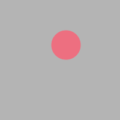

# Colorful snake
As long as the mouse is moved, there will be a string of ellipses created with rainbow color.

### How I made this
The program uses two array containing integers from 1-50. These arrays will represent as locations ellipses. While in the loop, the array values are shifted right one step for both. The last value of the array will be location at (mouseX,mouseY). Then, it will sketch ellipses with locations from the two arrays and radius as index of each value. 
