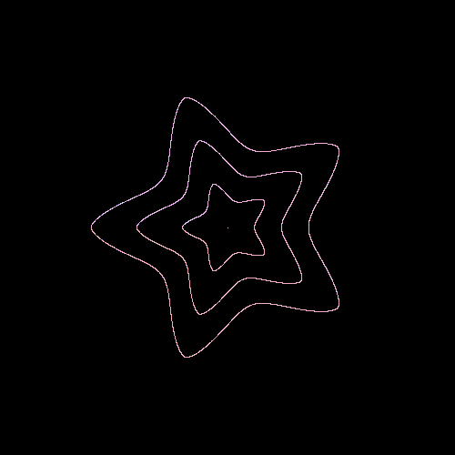

# Supershape animation
This is a sketch of supershape based on superformula. You can it [here](https://en.wikipedia.org/wiki/Superformula)

## How I made it
I created supershape() to create and display a supershape based on this [formula](https://en.wikipedia.org/wiki/Superformula). The scale of each shape is changed depending on mouseX and mouseY.